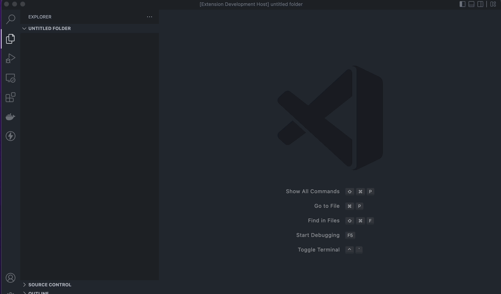

# Chattriggers for Visual Studio Code

This extension aids in the development of [Chattriggers](https://chattriggers.com) modules.

## Features

* Project templates to get started.
* Full intellisense autocompletion for CT library.
* `metadata.json` schema.

## Planned Features

* Many more project templates.
* Supporting ASM.
* Linting.

## Extension Settings

This extension contributes the following settings:

* `chattriggers.defaultCreator`: The default for the creator field used by the interactive module initialization command.
* `chattriggers.enabled`: Controls if Chattriggers extension features are enabled.
* `chattriggers.detectWorkspaces`: Automatically detect ChatTriggers workspaces by looking for a `metadata.json` file.

## Known Issues

None are known right now but this extension is still very young and there are likely many issues. If you find one, please file it on the [github](https://github.com/Maxssho13/Chattriggers-vscode/issues).

## Release Notes

### 0.0.1

Initial release of Chattriggers extension. Still very early in development.

